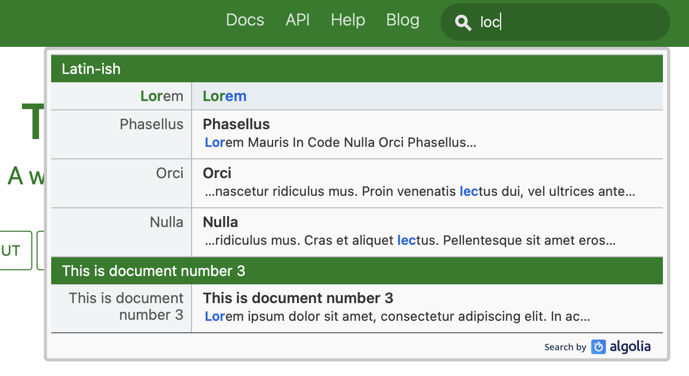

# docusaurus-local-search

> Example GitHub Actions workflow to build a Docusaurus site and index it for search using Algolia's [DocSearch crawler](https://docsearch.algolia.com/docs/run-your-own/#run-the-crawl-from-the-docker-image).

[Live Example](https://craigpalermo.github.io/docusaurus-local-search/)

## What the workflow does

- Check out docs repo
- Install Node.js
- NPM Install and build the static Docusaurus site
- So the site works with GitHub Pages, write a `.nojekyll` to the build folder
- Deploy static site to GitHub Pages
- Run DocSearch scraper from a Docker container using environment variables for `API_KEY` and `APPLICATION_ID`.

### Alternatives to GitHub Pages

For private/internal sites that you can't host on GitHub Pages, you can modify the workflow to serve the static site folder with a lightweight HTTP server like [serve](https://www.npmjs.com/package/serve).

## Resources

- [Algolia Crawler](https://www.algolia.com/products/crawler/)
- [Run your own DocSearch crawler](https://docsearch.algolia.com/docs/run-your-own/#run-the-crawl-from-the-docker-image)
- [Using DocSearch in Docusaurus](https://v2.docusaurus.io/docs/search#using-algolia-docsearch)
